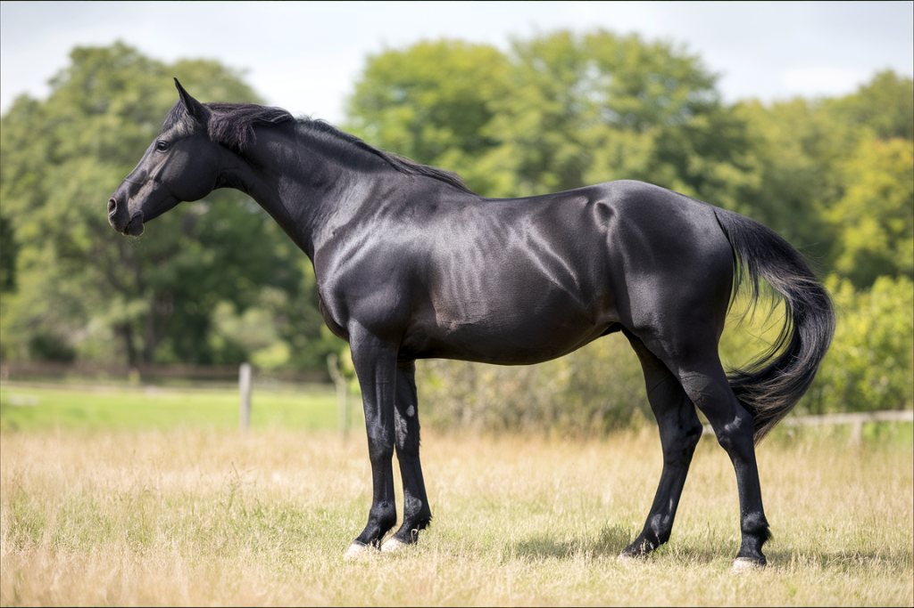

<figure>
  
  <figcaption>© 2024 Iloisten Kavioiden Kartano. Kuva generoitu AI-avusteisesti.</figcaption>
</figure>

Nimi
: Idochka

Rotu
: Venäjänratsuhevonen

Sukupuoli
: Tamma

Syntymäpäivä
: 06.04.2011

Säkä
: 160cm

Väritys
: musta

Merkit
: *ei merkkejä*

Omistaja
: Tilli / tilli@proton.me

Painotus
: Esteratsastus / 120cm

Rekisterinumero
: VH15-101-0037

### Historia

Tähän historia...

### Luonne

Idochka on hoitotilanteissa haastava ja vaatii kärsivällisyyttä. Hän saattaa olla levoton ja yrittää väistellä hoitotoimenpiteitä, erityisesti jos kyseessä on uusi hoitaja. Idochka on erityisen tarkka jaloistaan ja saattaa olla vastahakoinen antamaan niitä nostettavaksi. Harjauksesta hän kuitenkin nauttii, kunhan hoitaja on rauhallinen ja määrätietoinen. Idochka arvostaa rutiineja ja totuttuaan tiettyyn hoitojärjestykseen, hän alkaa rentoutua ja yhteistyö paranee. Suihkutuksesta hän ei erityisemmin pidä, mutta sietää sen, jos se tehdään lempeästi ja nopeasti. Hoitajan on tärkeää pysyä rauhallisena ja itsevarmana kaikissa tilanteissa, sillä Idochka aistii herkästi epävarmuuden ja saattaa yrittää ottaa tilanteen haltuunsa.

Idochka on tallissa yleensä rauhallinen, mutta tarkkaavainen. Hän seuraa tarkasti tallin tapahtumia ja reagoi herkästi ääniin ja liikkeisiin. Karsinassaan Idochka pitää järjestyksestä ja saattaa hermostua, jos hänen rutiininsa häiriintyvät. Hän on tarkka ruoka-ajoistaan ja ilmaisee kärsimättömyytensä, jos ruoka on myöhässä. Idochka tulee hyvin toimeen naapuriensa kanssa, mutta pitää mielellään oman tilansa. Hän nauttii rauhallisista hetkistä karsinassaan, mutta kaipaa myös säännöllistä ulkoilua ja liikuntaa pysyäkseen tyytyväisenä. Yöaikaan Idochka on yleensä rauhallinen nukkuja, mutta saattaa joskus hätkähtää hereille pienistäkin äänistä.

Ratsastaessa Idochka on energinen ja eteenpäinpyrkivä. Hän vaatii vahvaa ja varmaa ratsastajaa, joka osaa antaa selkeitä apuja. Idochka reagoi herkästi ratsastajan kehonkieleen ja saattaa testata kokemattomampia ratsastajia. Hän on älykäs ja oppii nopeasti uusia asioita, mutta voi myös kyllästyä helposti liian toistuviin harjoituksiin. Idochka nauttii haasteista ja suoriutuu parhaiten, kun hänelle annetaan monipuolisia tehtäviä. Maastossa hän on rohkea ja varmajalkainen, mutta saattaa innostua liikaa avoimilla alueilla.

Kilpailutilanteissa Idochka on parhaimmillaan. Hän syttyy kilpailun tuomasta jännityksestä ja on erittäin keskittynyt tehtäväänsä. Idochka vaatii huolellisen lämmittelyn ennen suoritusta rauhoittuakseen ja keskittyäkseen. Hän on vahva kilpailija ja antaa kaikkensa radalla, mutta saattaa turhautua nopeasti, jos asiat eivät suju suunnitellusti. Idochka reagoi herkästi yleisön energiaan ja saattaa esittää ylimääräistä temperamenttia jännittävissä tilanteissa. Kilpailun jälkeen Idochka vaatii rauhallista jäähdyttelyä ja aikaa rauhoittua ennen talliin palaamista.

Idochka on määrätietoinen ja voimakastahtoinen hevonen, joka tarvitsee johdonmukaisen ja varman käsittelijän, jotta yhteistyö sujuisi saumattomasti. Hän on älykäs ja oppii nopeasti, mutta saattaa myös käyttää älykkyyttään testatakseen rajoja. Idochka on hyvin herkkä ympäristölleen ja reagoi nopeasti muutoksiin, mikä tekee hänestä joskus haastavan käsitellä uusissa tilanteissa. Hän on kuitenkin myös erittäin lojaali ja muodostaa vahvan siteen luotettaviin ihmisiin. Idochka nauttii haasteista, mikä tekee hänestä erinomaisen kilpahevosen. Hän on itsevarma ja tietoinen omista kyvyistään, mikä voi joskus näyttäytyä itsepäisyytenä. Pohjimmiltaan Idochka on kuitenkin herkkä ja kaipaa paljon positiivista vahvistusta ja kehuja suorituksistaan.

### Suku

I: Isän Nimi
  - II: Iso Isän Nimi
     - III: Iso Isän Isän Nimi
     - IIE: Iso Isän Emän Nimi
  - IE: Iso Emän Nimi
    - IEI: Iso Emän Isän Nimi
    - IEE: Iso Emä EmMän Nimi
   
E: Emän Nimi
  - EI: Iso Isän Nimi
    - EII: Iso Isän Isän Nimi
    - EIE: Iso Emän Emän Nimi 
  - EE: Iso Emän Nimi
    - EEI: Iso Emän Isän Nimi
    - EEE: Iso Emä Emän Nimi 
